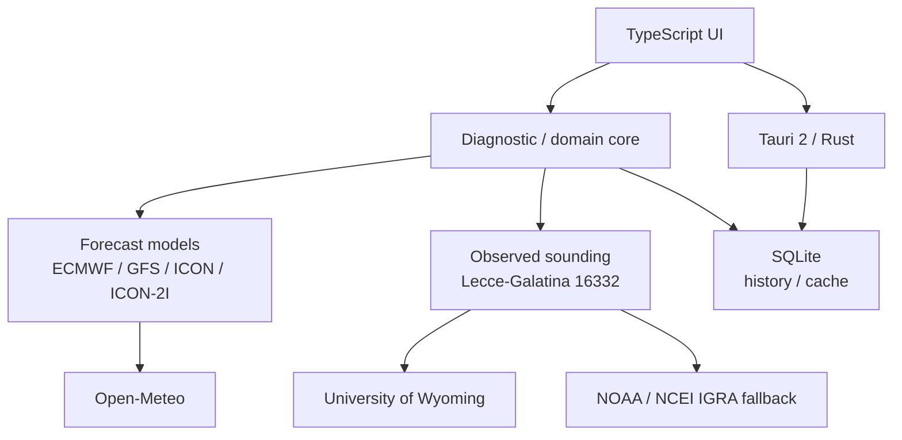

# MeteoCasarano Lab

Experimental multi-model weather analysis application for **Casarano and the Basso Salento area in Southern Italy**.

This public repository contains the official Windows releases of the project and serves as a technical overview of the application. The source repository is currently private.

> **Project status:** experimental / non-operational meteorological analysis tool. The diagnostic indices produced by the application are not official forecasts, warnings or Civil Protection alerts.

## What the application does

MeteoCasarano Lab combines forecast-model data, local persistence and observed upper-air data to support structured analysis of potentially significant weather conditions.

Main capabilities include:

- geographic grid focused on Casarano and the surrounding area;
- comparison of **ECMWF IFS, NOAA GFS, DWD ICON and ItaliaMeteo ICON-2I**;
- experimental 0–100 diagnostic indices for thunderstorms, severe convection, cloudbursts, hail, gusts/downbursts, convective organization and snow potential;
- reliability indicators, diagnostic reasons and factor contributions;
- observed sounding support for **Lecce-Galatina WMO 16332**, with University of Wyoming as primary source and NOAA/NCEI IGRA as fallback;
- model-versus-observation comparison;
- local SQLite archive for analyses, radiosoundings and Open-Meteo cache;
- real/composite and historical model-run handling;
- interactive map and time navigation;
- Windows auto-updater;
- Windows x64 builds and a signed Android ARM64 APK in the private development workflow.

## Engineering focus

The project is intentionally more than a UI prototype. It was built around a few concrete engineering problems:

### Multi-source data normalization

External weather data is validated and normalized before entering the application domain. Different forecast models and sounding sources are handled through a common internal representation.

### Missing-data handling

Missing meteorological parameters are treated explicitly rather than silently coerced to zero. Diagnostic reliability is reduced when required information is incomplete.

### Model comparison rather than single-model dependence

The application keeps the contributing forecast models visible and separate, then produces a weighted multi-model synthesis. The observed sounding is used for comparison and diagnostics; it does **not** automatically rewrite model weights.

### Local persistence and reproducibility

SQLite is used for analysis history, radiosoundings and API cache. The release process is tied to an exact Git commit and clean builds are reproduced from that commit rather than from an arbitrary working tree.

### Cross-platform packaging

The application combines a TypeScript frontend with a Rust/Tauri backend and has been packaged for Windows and Android during development.

## Architecture



### Main technologies

- **TypeScript**
- **Rust**
- **Tauri 2**
- **SQLite**
- Open-Meteo APIs
- OpenStreetMap tiles

## Verified release state — v0.3.3

The v0.3.3 release cycle recorded the following checks in the private development repository:

- **19 TypeScript/core tests passed**;
- **5 Rust unit tests passed**;
- SQLite migration integration test passed;
- clean rebuild from the exact release commit;
- Windows x64 NSIS and MSI packages produced;
- Tauri updater signatures produced and verified;
- public GitHub release published;
- updater endpoint verified;
- Android ARM64 APK built, signed and verified in the development workflow.

The release build was tied to commit:

`7634a94823e7e92cc51b71bfa967f2f64b3dfa0a`

## Download

Official public Windows builds are published only in this repository's **Releases** section:

[View releases](https://github.com/marcomastroleo/MeteoCasarano-Lab-Releases/releases)

Published release assets can include:

- Windows NSIS installer (`.exe`);
- Windows MSI installer (`.msi`);
- `SHA256SUMS.txt` for integrity verification;
- updater metadata where applicable.

## Verify a Windows download

After downloading an installer, calculate its SHA-256 hash in PowerShell:

```powershell
Get-FileHash "MeteoCasarano Lab_0.3.3_x64-setup.exe" -Algorithm SHA256
```

The result must match the checksum published with the corresponding release.

## Windows code-signing note

The Windows installers currently do not use a commercial Authenticode certificate. Windows SmartScreen may therefore display **Unknown publisher**, especially for a new or low-distribution build.

The Tauri updater uses its own release-signing mechanism. For public installer verification, download only from this repository and compare the published SHA-256 checksum.

## Why the source repository is private

This repository is intentionally the public distribution and project-overview repository. Publishing the installers here does not imply publication of the source code or grant rights beyond those explicitly stated elsewhere.

The public overview focuses on the engineering decisions, release discipline and observable project outputs without presenting the experimental meteorological diagnostics as scientifically validated forecasting products.

## Third-party components

Distributed installers include the notices and materials required by the third-party dependencies used in the build, including components subject to the Mozilla Public License 2.0 where applicable.

## Disclaimer

MeteoCasarano Lab is an amateur and experimental project. Its outputs must not be used as an official warning service or as a substitute for professional meteorological forecasts, Civil Protection communications or official weather services.
